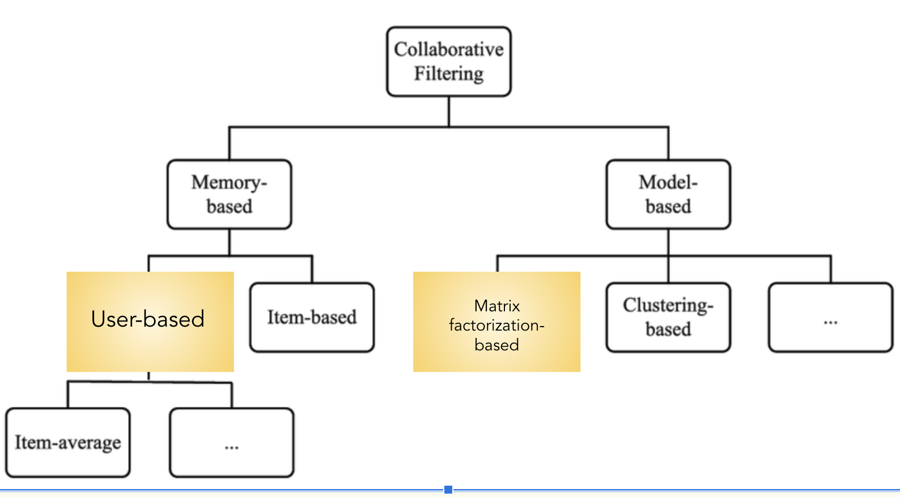
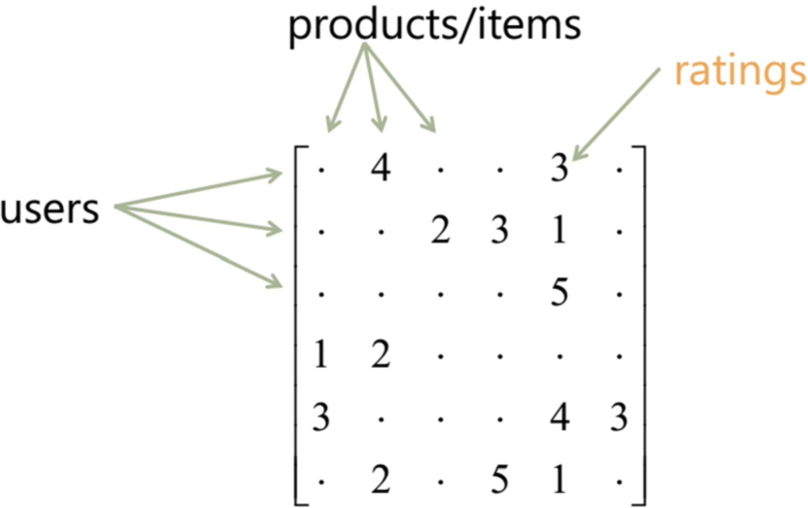
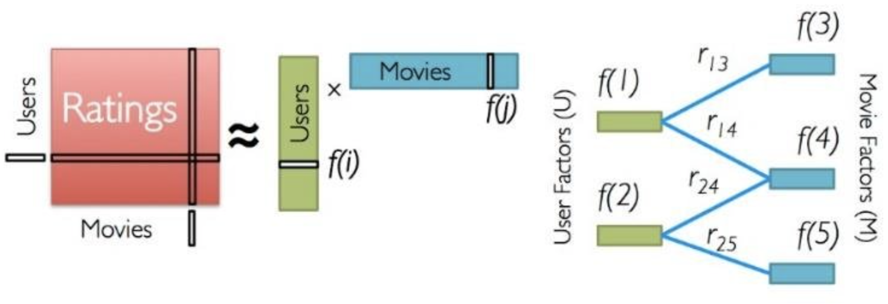
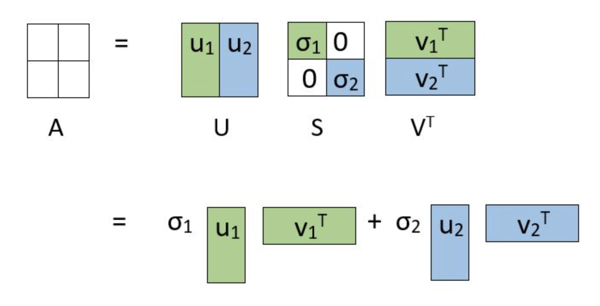
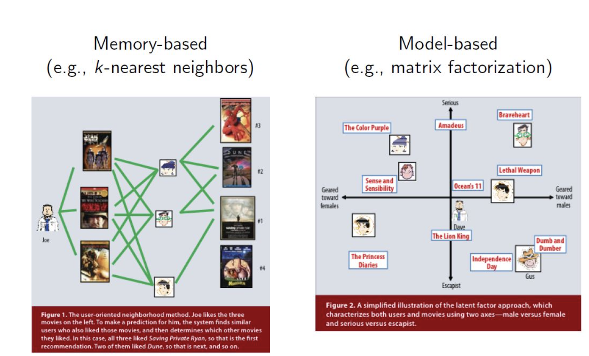
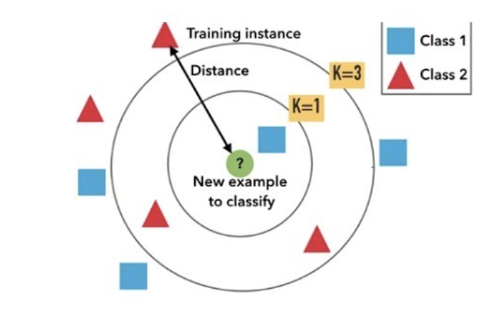

# CineSYNC: Stream to Success
**An Exploratory Approach to Personalized Recommendation Systems**

*By:* Madeline Birch
*Published:* November 20, 2023

# The Problem
### Our Stakeholder
Our protagonist in this story is cineSYNC, a veteran streaming service that's resurrecting itself out of obscurity. The platform's many users celebrate the outdated, low-tech simplicity of its straightforward movie library and basic UI. Bolstered by recent investments, cineSYNC has set its sights on a major transformation, aiming to provide a more personalized user experience competitive with industry heavyweights like Netflix and HBO Max, while maintaining their integrity as a universally approachable brand and affordable service. Deviating from their longstanding ads-only revenue model, cineSYNC is prepared to offer low-cost subscriptions in exchange for user profiles, rating options, and customized title recommendations, recognizing that the key to success lies in aligning with user tastes and meeting user preferences. 

### Our Mission
Our mission is to introduce cineSYNC to the basics and intricacies of user-based recommendation systems. We'll delve into various collaborative filtering techniques such as Singular Value Decomposition (SVD) and Alternating Least Squares (ALS), demystify the underlying concepts, and evaluate model performance.

[Image source: https://medium.com/@ashmi_banerjee/understanding-collaborative-filtering-f1f496c673fd]

#### Why Collaborative Filtering?
Collaborative filtering holds a distinct advantage in capturing complex and evolving user preferences. Consider this example: if a person A likes item 1, 2, 3 and B likes 2,3,4, then we can assume that A might like item 4 and B might like item 1*. Unlike content-based approaches, which rely on item characteristics, collaborative filtering adapts dynamically to user behavior, leveraging the wisdom of the crowd to predict user ratings. 

* *Source:* https://medium.com/@patelneha1495/recommendation-system-in-python-using-als-algorithm-and-apache-spark-27aca08eaab3

# The Data

In this project, we will be working with the MovieLens dataset provided by the GroupLens research lab at the University of Minnesota. The dataset is a well-known resource in the field of recommendation systems and contains information about movies, user ratings, and user-generated tags.

### Dataset Components
The dataset is distributed in the ml-latest-small.zip archive. We will primarily be working with `ratings.csv` to predict user ratings, and `movies.csv` to get movie titles.

**`movies.csv:`** This file contains information about movies, including their unique identifiers (movieId), titles, and genres. It is an essential part of our recommendation system as it provides details about the movies that users have rated.

**`ratings.csv:`** This file contains user ratings for various movies. It includes the user's unique identifier (userId), the movie's unique identifier (movieId), the rating they assigned to the movie, and a timestamp indicating when the rating was recorded. This dataset will be the primary source for building our recommendation system based on collaborative filtering.

# Data Preparation

*See notebook for a full EDA and plotted distributions of 'ratings' and other engineered features.* 

**For modeling, will be working with a cleaned and filtered version of `ratings_df`, merged with a one-hot encoded `movies_df` as `movies_and_ratings_df` for ease of use in future content-based and/or hybrid modeling.** 

# Modeling

### Target
Because we are using collaborative filtering, our prediction target will be the `'ratings'` feature from `ratings_df`.

### Evaluation Metrics
#### RMSE (Root Mean Squared Error):
RMSE measures the average magnitude of the differences between predicted and actual values, emphasizing larger errors. For cineSYNC, a lower RMSE indicates better predictive accuracy and alignment with user preferences. The closer to 0, the more accurate.

[Image source: https://docs.oracle.com/en/cloud/saas/planning-budgeting-cloud/pfusu/img/insights_rmse_formula.jpg]

#### MAE (Mean Absolute Error):
MAE gauges the average absolute differences between predicted and actual values, providing a more straightforward measure of model performance. Similar to RMSE, a lower MAE signifies better accuracy in predicting user preferences.

[Image source: https://medium.com/@polanitzer/the-minimum-mean-absolute-error-mae-challenge-928dc081f031]

### Model Types Used

In this project, we explore 3 total models: 2 matrix factorization models and 1 user-based, memory-based model.

### Matrix Factorization Models

Matrix Factorization is a process of decomposing a user-item matrix into latent (underlying) factors, capturing hidden patterns and enabling prediction of missing values within the matrix for personalized recommendations.

Here is a quick look at what we mean by user-item matrix:

[User-Item Matrix]

#### Model 1: Alternating Least Squares (ALS) with PySpark

The first matrix factorization algorithm we are testing is ALS.

A quick glance at the ALS algorithm at work:

[ALS Algorithm Visualized]

Essentially, the ALS algorithm optimizes the latent factors by iteratively decomposing the user-item interaction matrix, minimizing the reconstruction error between observed and predicted ratings. This iterative optimization process is the hallmark of ALS, as it alternates between fixing one matrix (either user or item factors) and optimizing the other. Through this alternating process, ALS uncovers latent features that represent user preferences, facilitating the generation of accurate and personalized recommendations.

**Advantages:** ALS can be parallelized effectively, which means it can handle large-scale, sparsely populated datasets and computations efficiently.

**Limitations:** ALS is an iterative optimization algorithm, and its final solution can depend on the initial values assigned to the user and item latent factors. Depending on the starting point, ALS may get stuck in a local minimum, leading to suboptimal results.

*See notebook for full code and markdown of ALS modeling.*

Here is a sample output of our ALS model at work for user 123:

[Top 10 Recommendations for User 123 based on ALS Model]

**NOTE:** *ALS is a stochastic algorithm. Stochastic algorithms introduce an element of randomness in their operations, leading to potentially different outcomes on each run, even with the same initial conditions.

#### Model 2: Singular Value Decomposition (SVD) with Surprise

The second matrix factorization algorithm we are testing is SVD.

Here is SVD-at-a-glace:

[SVD Algorithm Visualized]

In a nutshell, the SVD algorithm decomposes the user-item interaction matrix into three matrices: `U` (user matrix), `Σ` (diagonal matrix of singular values), and `V^T` (item matrix transpose). By retaining only the top singular values (values of highest importance), SVD reduces the dimensionality of the original matrix, revealing latent factors that represent underlying patterns in the data.

**Advantages:** SVD provides a compact representation of latent factors, enabling efficient storage and faster computation for recommendations.

**Limitations:** SVD may struggle with handling missing values, and it may not perform well in situations where the user-item interaction matrix is highly sparse.

Here is our SVD model at work for user 300:

[Top 10 Recommendations for User 300 based on SVD Model]

*See notebook for full code of SVD modeling.*

### Memory-based Model

Memory-based CF models are rooted in the idea that users who have agreed in the past are likely to agree again in the future, utilizing the "memory" of past interactions to predict unseen items.

Here is a look at how a user-based, memory-based algorithm works in comparison to matrix factorization algorithms:

[Memory-based vs Matrix Factorization]

#### Model 3: KNNWithMeans with Surprise
 
The memory-based algorithm we are testing is the KNNWithMeans algorithm. 

[KNNWithMeans Model Visualized]

Basically, "k" refers to the number of neighbors considered when making predictions, implying identifying users with similar tastes and incorporating their opinions to predict how a particular user might rate a movie. KNNWithMeans calculates predictions by considering the weighted average of ratings from users who share similarities, adjusting for each user's mean rating. This adjustment, referred to as "means," helps account for the inherent variability in how users rate items.

Here is a look at our KNNWithMeans algorithm at work for user 59:

[Top 10 Recommendations for User 59 based on KNNWithMeans Model]

*See notebook for full code of KNNWithMeans modeling.*

#### Model 4: Tuned KNNWithMeans 

Building on our original KNNWithMeans model to see if we can get lower evaluation metrics, we will focus here on the `sim_options_tuned` snippet, found in `notebook.ipynb`:

1. **K Neighbors (`k`):** Instead of letting Surprise set a default value for`k` (the number of similar users to consider when making predictions), we set it to 1o ourselves. A lower value often leads to more personalized recommendations.
2. **min_support:** `min_support` is set to 50, indicating that there must be a minimum of 50 common items between two users for them to be considered neighbors.
3. **`shrinkage`:** A higher shrinkage value like 300 indicates stronger regularization, which can be beneficial in scenarios with sparse data or when you want to prevent the model from overfitting to the training data

#### All Model Evaluations

We've created a table that shows all of our evaluation metrics in one place so that we can see how our model iterations have yielded increasingly more favorable RMSE and MAE scores:

[DataFrame of All Model Evaluation Metrics]

# Conclusions & Recommendations

**Key Findings:**

    - A tuned version of KNNWithMeans (KNN2) shows the best performance, with an RMSE of 0.318239 and MAE of 0.195525, showcasing the impact of hyperparameter optimization. This is an improvement upon both the ALS and SVD models’ scores.
    - On average, the tuned KNN model's predictions deviate from actual user ratings by around 0.32 stars. 

### Recommendations

- *Use and refine the tuned KNNWithMeans (KNN2) model,* experimenting with different values for parameters like 'k,' 'min_support,' and 'shrinkage' to optimize configuration.

    - *Advantages of this model*:
        - Its interpretability and adaptability to changing user preferences make it well-suited for smaller datasets.
        - Unlike matrix factorization, which excels at handling sparse data and imputing missing values, KNNWithMeans provides transparency in recommendations, facilitating a clearer understanding of the underlying basis.
        - Particularly beneficial for smaller datasets, KNNWithMeans simplifies implementation by avoiding the complex training processes associated with matrix factorization, offering a practical and effective choice for scenarios prioritizing interpretability and adaptability to evolving preferences.

    - *Disadvantages of this model:* 
        - This model can be computationally expensive, especially as the dataset grows.
        - This model may also struggle with the cold start problem for new users or items with limited interaction history. 

- *To address the cold start problem*, we suggest a content-based or hybrid approach to provide content based recs for users with limited interaction. By combining content-based recommendations with k-NN with Means, you can provide meaningful suggestions even when there is insufficient interaction data.

### Next Steps
1. **Scale Up Dataset:** Our modeling project utilized a small subset of the available data. Moving forward, we recommend expanding usage of the dataset to capture a broader spectrum of user preferences.

2. **Exploring Additional Metrics:** While RMSE and MAE provide valuable insights into model accuracy, it's essential to consider alternative evaluation metrics such as NDCG (Normalized Discounted Cumulative Gain) or MAP (Mean Average Precision). These metrics may offer a more nuanced understanding of model performance, especially in scenarios where the emphasis is on the ranking quality of user recommendations.

3. **Implementing User Feedback:** Incorporating direct user feedback is a powerful strategy for continuous improvement. By collecting and analyzing user ratings and interactions with recommended movies, cineSYNC can refine its models over time, adapting to evolving user preferences. Here are some ideas:
    - Implement a simple thumbs-up or thumbs-down feedback option for quick responses.
    - Track implicit feedback, such as the amount of time a user spends watching a recommended movie or the number of times they replay a specific scene.
    - Periodically prompt users to participate in preference surveys.
    - Monitor the click-through rate for recommended movies.
    - Conduct A/B testing with different recommendation algorithms or variations of existing models.
    - Allow users to curate their watchlist, and use this information to refine recommendations.
    - Implement a "Recommended for You" section based on individual user preferences.
    - Regularly update the recommendation model with the latest user feedback.
    
    
4. **Exploring Content-Based or Hybrid Approaches:** While collaborative filtering excels in capturing user preferences, a hybrid approach that integrates content-based recommendations will be crucial. Considering features such as genre, director, or actor information in tandem with CF models will yield richer and more diverse recommendations.

### Repo Structure

├── Data

├── Images

├── README.md

└── notebook.ipynb

├── presentation.pdf

### Image Sources:
https://medium.com/@ashmi_banerjee/understanding-collaborative-filtering-f1f496c673fd

https://www.researchgate.net/figure/Classification-of-collaborative-filtering-algorithms_fig4_303556519

https://docs.oracle.com/en/cloud/saas/planning-budgeting-cloud/pfusu/img/insights_rmse_formula.jpg

https://www.researchgate.net/publication/344710326/figure/fig1/AS:960349452902410@1605976560779/User-item-matrix-in-a-recommender-system.png

https://www.researchgate.net/profile/Serkan-Ayvaz/publication/338721765/figure/fig2/AS:894097657184256@1590180901710/Alternating-Least-Squares-Method.jpg

https://cdn.analyticsvidhya.com/wp-content/uploads/2019/07/svd.jpg1.jpg

https://abgoswam.files.wordpress.com/2016/06/cf.jpg

https://i.ytimg.com/vi/kccT0FVK6OY/maxresdefault.jpg
