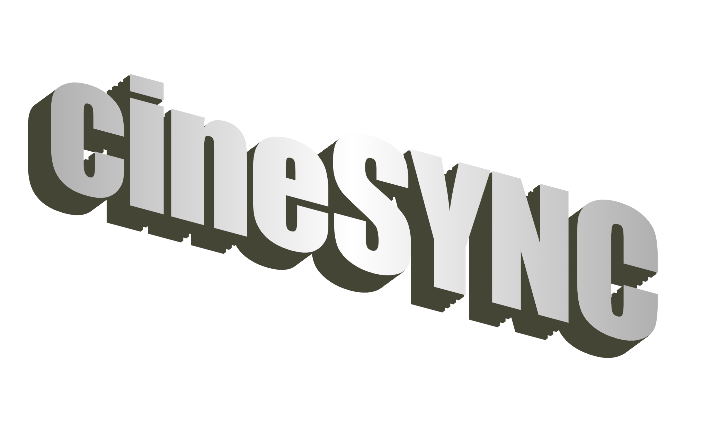

# CineSYNC: Navigating the Stream to Success
**An Exploratory Approach to Personalized Recommendation Systems**

# Business Understanding
### Our Primary Stakeholder
Our protagonist in this story is CineSYNC, a veteran streaming service that's resurrecting itself out of obscurity. Established in 2006 and operating as "the people's streaming service" ever since, the platform's many users celebrate the outdated, low-tech simplicity of its straightforward movie library and basic UI akin to that of vintage piracy sites like Levidia.ch or Project Free TV. Bolstered by recent investments, CineSYNC has set its sights on a major transformation, aiming to provide a more personalized user experience competitive with industry heavyweights like Netflix and HBO Max, while maintaining their integrity as a universally approachable brand and affordable service. Deviating from their longstanding ads-only revenue model, cineSYNC is prepared to offer low-cost subscriptions in exchange for user profiles, rating options, and customized title recommendations, recognizing that the key to success lies in aligning with user tastes and meeting user preferences. 

### Our Mission
Our mission is to introduce CineSYNC to the basics and intricacies of user-based recommendation systems. We'll delve into various collaborative filtering techniques such as Singular Value Decomposition (SVD) and Alternating Least Squares (ALS), demystify the underlying concepts, and evaluate model performance. Model evaluation metrics RMSE (root mean squared error) and MAE (mean absolute error) will be our compass along this exploratory journey, laying the groundwork for CineSYNC to build on and iterate further in modeling processes of their own. With our foundational support, CineSYNC can be better positioned as a leading underdog among industry giants.

