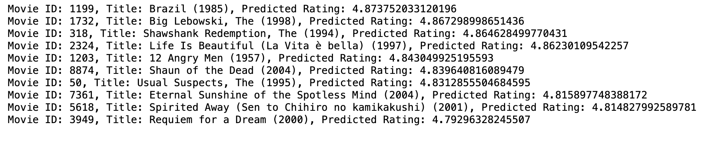

# CineSYNC: Stream to Success
**An Exploratory Approach to Personalized Recommendation Systems**

# Business Understanding
### Our Primary Stakeholder
Our protagonist in this story is cineSYNC, a veteran streaming service that's resurrecting itself out of obscurity. Established in 2006 and operating as "the people's streaming service" ever since, the platform's many users celebrate the outdated, low-tech simplicity of its straightforward movie library and basic UI akin to that of vintage piracy sites like Levidia.ch or Project Free TV. Bolstered by recent investments, cineSYNC has set its sights on a major transformation, aiming to provide a more personalized user experience competitive with industry heavyweights like Netflix and HBO Max, while maintaining their integrity as a universally approachable brand and affordable service. Deviating from their longstanding ads-only revenue model, cineSYNC is prepared to offer low-cost subscriptions in exchange for user profiles, rating options, and customized title recommendations, recognizing that the key to success lies in aligning with user tastes and meeting user preferences. 

### Our Mission
Our mission is to introduce cineSYNC to the basics and intricacies of user-based recommendation systems. We'll delve into various collaborative filtering techniques such as Singular Value Decomposition (SVD) and Alternating Least Squares (ALS), demystify the underlying concepts, and evaluate model performance. Collaborative filtering, a key focus of our exploration, involves recommending items based on the preferences and behavior of similar users. This approach, in contrast to content-based or hybrid filtering systems, harnesses the collective wisdom of the user community, allowing cineSYNC to tap into the diverse tastes of its audience.

[Image source: https://medium.com/@ashmi_banerjee/understanding-collaborative-filtering-f1f496c673fd]

#### Why Collaborative Filtering?
Collaborative filtering holds a distinct advantage in capturing complex and evolving user preferences. Unlike content-based approaches, which rely on item characteristics, collaborative filtering adapts dynamically to user behavior, making it well-suited for platforms like cineSYNC with a vast and diverse content library. By leveraging the wisdom of the crowd, collaborative filtering facilitates personalized recommendations, enhancing user satisfaction and engagement.

# Data Understanding

In this project, we will be working with the MovieLens dataset provided by the GroupLens research lab at the University of Minnesota. The dataset is a well-known resource in the field of recommendation systems and contains information about movies, user ratings, and user-generated tags.

### Dataset Components
The dataset is distributed in the ml-latest-small.zip archive and contains the following four CSV files:

**`movies.csv:`** This file contains information about movies, including their unique identifiers (movieId), titles, and genres. It is an essential part of our recommendation system as it provides details about the movies that users have rated.

**`ratings.csv:`** This file contains user ratings for various movies. It includes the user's unique identifier (userId), the movie's unique identifier (movieId), the rating they assigned to the movie, and a timestamp indicating when the rating was recorded. This dataset will be the primary source for building our recommendation system based on collaborative filtering.

**`tags.csv:`** This file contains user-generated tags for movies. Each entry includes the userId, movieId, the tag text, and a timestamp. While not the focus of our exploration in collaborative filtering, it is worth highlighting here for the purposes of cineSYNC's future content-based or hybrid modeling endeavors.

**`links.csv:`** This file contains links to external movie databases such as IMDb and TMDb, using identifiers for movieId. This external data could be useful to cineSYNC, but do not fit within the scope of our project.

# Data Preparation

*See notebook for a full EDA and plotted distributions of 'ratings' and other engineered features.* 

**For modeling, will be working with a cleaned and filtered version of `ratings_df`, merged with a one-hot encoded `movies_df` as `movies_and_ratings_df` for ease of use in future content-based and/or hybrid modeling.** 

# Modeling

### Target
Because we are using collaborative filtering, our prediction target will be the `'ratings'` feature from `ratings_df`.

### Evaluation Metrics
#### RMSE (Root Mean Squared Error):
RMSE measures the average magnitude of the differences between predicted and actual values, emphasizing larger errors. For cineSYNC, a lower RMSE indicates better predictive accuracy and alignment with user preferences. The closer to 0, the more accurate.

[Image source: https://docs.oracle.com/en/cloud/saas/planning-budgeting-cloud/pfusu/img/insights_rmse_formula.jpg]

#### MAE (Mean Absolute Error):
MAE gauges the average absolute differences between predicted and actual values, providing a more straightforward measure of model performance. Similar to RMSE, a lower MAE signifies better accuracy in predicting user preferences.

[Image source: https://medium.com/@polanitzer/the-minimum-mean-absolute-error-mae-challenge-928dc081f031]

### Model 1: Alternating Least Squares (ALS) with PySpark

#### What is ALS?
To begin our journey into cineSYNC's potential with CF systems, we'll firstly introduce the ALS model. The ALS (Alternating Least Squares) recommendation model is a supervised learning algorithm commonly employed in recommendation systems. Unlike traditional supervised learning, where the algorithm learns from labeled data with explicit input-output pairs, ALS operates in a unique manner within the collaborative filtering framework.

In supervised learning, the algorithm learns a mapping from input features to target labels based on a labeled training dataset. In contrast, ALS is employed in a semi-supervised fashion for collaborative filtering, which inherently lacks explicit labels. Instead, it utilizes the implicit feedback inherent in user-item interactions, such as user ratings, to capture underlying patterns in the data.

The ALS algorithm optimizes the latent factors by iteratively decomposing the user-item interaction matrix, minimizing the reconstruction error between observed and predicted ratings. This iterative optimization process is the hallmark of ALS, as it alternates between fixing one matrix (either user or item factors) and optimizing the other. Through this alternating process, ALS uncovers latent features that represent user preferences, facilitating the generation of accurate and personalized recommendations.

#### How is PySpark Used in the Context of ALS?
**PySpark,** the Python API for Apache Spark, offers a scalable and distributed computing framework ideal for large-scale collaborative filtering tasks. ALS in PySpark facilitates the training of models on extensive datasets, ensuring efficient handling of user-item interactions. This is particularly valuable for cineSYNC's ambition to provide a more personalized user experience at scale.

*See notebook for full code and markdown of ALS modeling.*

[Top 10 Recommendations for User 123 based on ALS Model]

### ALS Model Evaluation

**ALS RMSE:** 0.5705045822613408

*On average, the predicted ratings deviate from the actual ratings by approximately 0.57 units (or 'stars') on a rating scale of 0 to 5.*

**ALS MAE:** 0.45136323380030924

*On average, the absolute difference between predicted and actual ratings is approximately 0.45 units (or 'stars') on a rating scale of 0 to 5.*

Both the RMSE and MAE values for our ALS model are under 1.0, indicating that the ALS collaborative filtering model is performing well in predicting user ratings. Users can expect the predicted ratings to be reasonably close to their actual ratings, making the model a promising tool for generating accurate movie recommendations within the collaborative filtering framework.

**NOTE:** *ALS is a stochastic algorithm. Stochastic algorithms introduce an element of randomness in their operations, leading to potentially different outcomes on each run, even with the same initial conditions. This randomness is intentional and often used to overcome challenges or limitations in deterministic algorithms. Though we took pains to set a seed for reproducibility of output, recommendations results and evaluation metrics may not be the same every time due to the distributed nature of Spark. However, running multiple iterations should provide insights into the stability of the recommendations.*

### Model 2: Singular Value Decomposition (SVD) with Surprise

#### What is SVD?
Welcome to Model 2, our second foray into exploring which collaborative filtering system would serve cineSYNC best. Here, we introduce Singular Value Decomposition (SVD) implemented with the Surprise library. SVD is a dimensionality reduction technique that transforms the user-item interaction matrix into a lower-dimensional representation of itself, capturing latent factors that contribute to user preferences. 

SVD decomposes the user-item interaction matrix into three matrices: `U` (user matrix), `Σ` (diagonal matrix of singular values), and `V^T` (item matrix transpose). By retaining only the top singular values, SVD reduces the dimensionality of the original matrix, revealing latent factors that represent underlying patterns in the data.

While traditional supervised ML algorithms learn from labeled data with explicit input-output pairs, SVD (like ALS) utilizes implicit feedback from user-item interactions. In a supervised learning paradigm, SVD learns to predict user ratings (labels, whichh, although not explicitly labeled, serve as a form of implicit feedback that guides the learning process) for items based on historical ratings. The goal is to minimize the difference between predicted and actual ratings, just like a regression problem in supervised learning.

#### Why Surprise?
The Surprise library serves as a fitting choice for implementing SVD in our recommendation system. Here's why:
- **Ease of Use:** Surprise abstracts away the complexity of SVD implementation, providing an intuitive interface that simplifies the integration of collaborative filtering algorithms.
- **Efficient Algorithms:** Surprise is optimized for efficiency, leveraging well-established algorithms for collaborative filtering tasks. This efficiency is crucial, especially when working with large-scale datasets.

*See notebook for full code of SVD modeling.*

[Top 10 Recommendations for User 300 based on SVD Model]

### SVD Model Evaluation

**SVD RMSE:** 0.4751

*Our SVD model's RMSE score is 0.475, indicating that, on average, the model's predictions deviate from actual ratings by around 0.4751 units (or 'stars'). We see a slight improvement with our SVD model compared to our ALS model in RMSE, jumping down from ~0.57 to 0.48.*

**SVD MAE:** 0.4044

*Our SVD model's MAE score is 0.4044, indicating that, on average, the absolute difference between predicted and actual ratings is around 0.4044 units (or 'stars').*

### Model 3: KNNWithMeans with Surprise
#### What is KNNWithMeans?
In our ongoing mission to refine cineSYNC's recommendation system, we're exploring the K-Nearest Neighbors with Means (KNNWithMeans) algorithm using the Surprise library. Unlike our previous models (ALS and SVD), KNNWithMeans operates within the realm of memory-based collaborative filtering. This approach is rooted in the idea that users who have agreed in the past are likely to agree again in the future, utilizing the "memory" of past interactions to predict unseen items.

The "k" in KNN refers to the number of neighbors considered when making predictions, implying identifying users with similar tastes and incorporating their opinions to predict how a particular user might rate a movie. KNNWithMeans calculates predictions by considering the weighted average of ratings from users who share similarities, adjusting for each user's mean rating. This adjustment, referred to as "means," helps account for the inherent variability in how users rate items.

In the context of collaborative filtering, a supervised learning approach involves training a model on existing user-item interactions to predict how users might rate unseen items. KNNWithMeans embraces this concept by learning from historical ratings of users who share similarities, using this knowledge to generate personalized recommendations.

#### Why Susprise (again)?
Surprise excels in handling user-item interaction data, streamlining the process of creating train-test splits, defining reader configurations, and training models. It offers a unified framework for various collaborative filtering algorithms, making it an ideal choice for our exploration of KNNWithMeans.

*See notebook for full code of KNNWithMeans modeling.*

[Top 10 Recommendations for User 59 based on KNNWithMeans Model]

### KNNWithMeans Model Evaluation

**KNN RMSE:** 0.3822

**KNN MAE:** 0.3201

*It appears our KNNWithMeans model's RMSE is better than our SVD model's, at 0.382, and the MAE score compared to the SVD model's has dropped to 0.320. Not a huge difference, but it gets us that must closer to accurately predicting our users' preferences.*

### Model 4: Tuned KNNWithMeans 

Building on our original KNNWithMeans model to see if we can get lower evaluation metrics, we will focus here on the `sim_options_tuned` snippet:

1. **K Neighbors (`k`):** Instead of letting Surprise set a default value for`k` (the number of similar users to consider when making predictions), we set it to 1o ourselves. A lower value often leads to more personalized recommendations.
2. **min_support:** `min_support` is set to 50, indicating that there must be a minimum of 50 common items between two users for them to be considered neighbors.
3. **`shrinkage`:** A higher shrinkage value like 300 indicates stronger regularization, which can be beneficial in scenarios with sparse data or when you want to prevent the model from overfitting to the training data

**KNN2 RMSE:** 0.3182

**KNN2 MAE:** 0.1955

Our RMSE and MAE values are getting closer and closer to 0 every time, indicating more and more accurate predictions.

It would be helpful to create a DataFrame that prints out all of our evaluation metrics in one place so that we can see how our model iterations have yielded increasingly more favorable scores:

[DataFrame of All Model Evaluation Metrics]

# Conclusions & Recommendations

**Key Findings:**

- ALS, with an RMSE of 0.570505 and MAE of 0.451363, showcased a respectable performance, laying a foundation for collaborative filtering.
- SVD excelled with an RMSE of 0.475072 and MAE of 0.404359, demonstrating its robustness in capturing nuanced user preferences.
- KNNWithMeans emerged as a powerful contender, achieving an RMSE of 0.382185 and MAE of 0.320137, highlighting its adaptability to dynamic user behavior.
- A tuned version of KNNWithMeans (KNN2) further elevated performance with an RMSE of 0.318239 and MAE of 0.195525, showcasing the impact of hyperparameter optimization.

**Collaborative Filtering Advantage:**
Collaborative filtering, our primary focus, proved advantageous for cineSYNC's diverse content library. It dynamically adapts to user behavior, making it well-suited for platforms with evolving user preferences.

### Recommendations

- *Use and refine the tuned KNNWithMeans (KNN2) model,* experimenting with different values for parameters like 'k,' 'min_support,' and 'shrinkage' to optimize configuration.

- *Advantages of this model*:
    - Its interpretability and adaptability to changing user preferences make it well-suited for smaller datasets.
    - Unlike matrix factorization, which excels at handling sparse data and imputing missing values, KNNWithMeans provides transparency in recommendations, facilitating a clearer understanding of the underlying basis.
    - Particularly beneficial for smaller datasets, KNNWithMeans simplifies implementation by avoiding the complex training processes associated with matrix factorization, offering a practical and effective choice for scenarios prioritizing interpretability and adaptability to evolving preferences.

- *Disadvantages of this model:* 
    - This model can be computationally expensive, especially as the dataset grows.
    - This model may also struggle with the cold start problem for new users or items with limited interaction history. 

- *Recommendation:* To address the cold start problem, we suggest a content-based or hybrid approach to provide content based recs for users with limited interaction. By combining content-based recommendations with k-NN with Means, you can provide meaningful suggestions even when there is insufficient interaction data.

### Next Steps
1. **Scale Up Dataset:** Our modeling project utilized a small subset of the available data. Moving forward, we recommend expanding usage of the dataset to capture a broader spectrum of user preferences.

2. **Exploring Additional Metrics:** While RMSE and MAE provide valuable insights into model accuracy, it's essential to consider alternative evaluation metrics such as NDCG (Normalized Discounted Cumulative Gain) or MAP (Mean Average Precision). These metrics may offer a more nuanced understanding of model performance, especially in scenarios where the emphasis is on the ranking quality of user recommendations.

3. **Implementing User Feedback:** Incorporating direct user feedback is a powerful strategy for continuous improvement. By collecting and analyzing user ratings and interactions with recommended movies, cineSYNC can refine its models over time, adapting to evolving user preferences. Here are some ideas:
    - Implement a simple thumbs-up or thumbs-down feedback option for quick responses.
    - Track implicit feedback, such as the amount of time a user spends watching a recommended movie or the number of times they replay a specific scene.
    - Periodically prompt users to participate in preference surveys.
    - Monitor the click-through rate for recommended movies.
    - Conduct A/B testing with different recommendation algorithms or variations of existing models.
    - Allow users to curate their watchlist, and use this information to refine recommendations.
    - Implement a "Recommended for You" section based on individual user preferences.
    - Regularly update the recommendation model with the latest user feedback.
    
    
4. **Exploring Content-Based or Hybrid Approaches:** While collaborative filtering excels in capturing user preferences, a hybrid approach that integrates content-based recommendations will be crucial. Considering features such as genre, director, or actor information in tandem with CF models will yield richer and more diverse recommendations.

### Final Notes to Consider for Model-Based Matrix Factorization

#### ALS (Alternating Least Squares):

**Advantage:** ALS is well-suited for handling sparse matrices, making it effective in scenarios where users interact with only a small subset of items.

**Disadvantage:** ALS may converge to local minima, and its performance can be influenced by the choice of hyperparameters, such as the regularization term.

#### SVD (Matrix Factorization):

**Advantage:** SVD provides a compact representation of latent factors, enabling efficient storage and faster computation for recommendations.

**Disadvantage:** SVD may struggle with handling missing values, and it may not perform well in situations where the user-item interaction matrix is highly sparse.